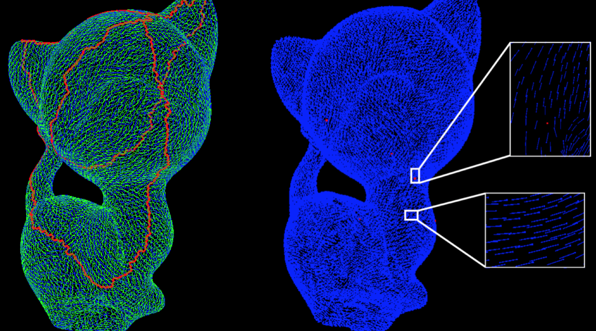

# Direction Fields 
The goal of vector field design is to describe the smoothest manner in which tangent vectors change when moved from one point to another on discrete surfaces. The changes are required to be independent of the path taken by the vectors, i.e., vectors transported around a loop should end up where they started. The motivation of designing such smoothly varying vector fields stems from applications in texture synthesis and quadrilateral remeshing. This repo implements the Trivial Connections paper by Crane et al.

Note: Requires Eigen 3.2.4, SuiteSparse and tbb. Assumes they are in /usr/local/Cellar/eigen/3.2.4/include/eigen3, /usr/local/Cellar/suite-sparse/4.2.1/include/ and /usr/local/Cellar/tbb/4.3-20150611/include/tbb respectively.
